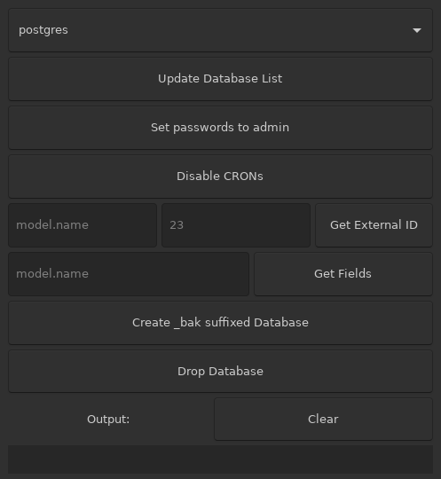

# dbtoolkit (c++)
GTK3 UI, helper for common odoo db commands written in C++

Uses `gtkmm` for gtk api, `pqxx` to interface with postgresql, `cpptoml` to parse configuration file.

Intended as a successor to [odoo-dbtoolkit](https://github.com/PeterAlabaster/odoo-dbtoolkit) (written in Godot engine) to address some of the cavetas

First C++ endeavour.
## Dependencies
### Compiling on debian base
```bash
$ sudo apt install -y libpqxx-dev libgtkmm-3.0-dev libcpptoml-dev
$ ./compile.sh
```
### Running on debian base
```bash
$ sudo apt install -y libpqxx-6.4
$ ./dbtoolkitgtk
```
## Configuration
`~/.dbtoolkit.toml` required, example contents.

All values must be quoted, fallbacks commented.

If fallback suffice, the key can be emitted:
```
[postgresql]
user = "odoo"  # "postgres"
password = "voodoo"  # "admin"
host = "192.168.0.66"  # "127.0.0.1"
port = "5436"  # "5432"
```
## Features
- Database lister with update button, shows all databases on the configured postgres instance
- Admin password setter, sets all `res.users` passwords on the currently selected database to `admin`
- Disable CRON button - sets all active `ir.cron` records on the currently selected database to `False`
- External ID getter - give a model `_name` and a database `ID` on the currently selected database and the _external_ ID will be displayed
- Field getter - give a model `_name` and get all columns available on the model
- Database template backup - create a `_bak` suffixed database using the currently selected database as a template
- Database dropper - drop a database
- Database backup restorer - if the `_bak` suffixed, or non suffixed (but a `_bak` suffixed db exists) db is selected, drop the non-suffixed db, and re-create it with the backup as a template

## Screenshot

## Roadmap (in order of priority)
- Some gtk output tidyup, output is scuffed when we have multiple columns. Space columns evenly like you'd get in a psql shell.
- Secure password storage in `~/.dbtoolkit.toml`?
- Extend field getter to show more useful information
- Output scrollwindow automatic expanding & contracting on content fill/removal.

## References
- https://docs.huihoo.com/gtkmm/programming-with-gtkmm-3/3.4.1/en
- http://pqxx.org/development/libpqxx/#quick-example
- https://github.com/skystrife/cpptoml#obtaining-basic-values
